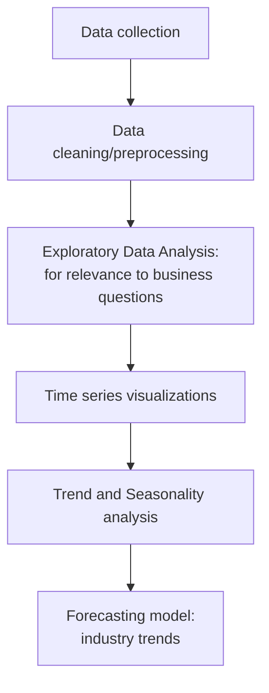

# Semiconductor sales & NVIDIA stock: Coursera Project

## Project Overview:
Analyse Raw data for Actionable insights.

## Why Semiconductor industry:
Sales are highly cyclic (boom and slowdown phases).
Critical industry for downstream industries (smartphone, cloud computing, etc.)

## Business Questions:
1. How does the semiconductor demand **change** over time?
 
   1a. Is the demand **slowing down**?
2. Are there **seasonal patterns** in demand?
3. What will be the **expected demand** over the next few months?

*Overarching Question:* How can companies plan **scaling-up or reducing output**, based on the seasonal patterns of demand?

## Approach/Methodology:

