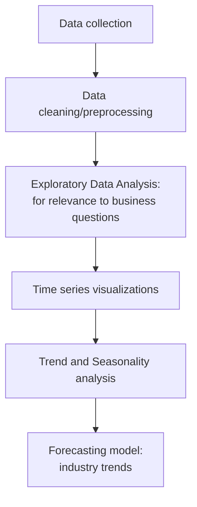
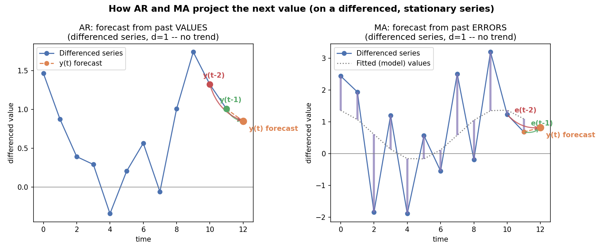

# Semiconductor sales & NVIDIA stock: Coursera Project

## Project Overview:
Analyse Raw data for Actionable insights.

## Why Semiconductor industry:
Sales are highly cyclic (boom and slowdown phases).
Critical industry for downstream industries (smartphone, cloud computing, etc.)

## Business Questions:
1. How does the semiconductor demand **change** over time?
 

   1a. Is the demand **slowing down**?
 

2. Are there **seasonal patterns** in demand?
 

3. What will be the **expected demand** over the next few months?

*Overarching Question:* How can companies plan **scaling-up or reducing output**, based on the seasonal patterns of demand?

## Approach/Methodology:

## Forecasting Model Concepts: AR, MA, ARIMA
**AR** = uses past **values**. Predicts $y_t$ using $y_{t-1}, y_{t-2}, ..., y_{t-p}$ + noise (residuals) — $p$ = number of lagged observations included (AR order). AR captures **momentum**.

**MA** = uses past **forecast errors**. Predicts $y_t$ using noise (residuals, mistakes) from the previous $q$ periods — $q$ = number of lagged forecast errors included (MA order).

**AR + MA + Integration (differencing) = ARIMA** (AutoRegressive Integrated Moving Average) — combines AR + MA, plus differencing to first make a non-stationary series stationary.

$$ARIMA(p, d, q) \quad p = \text{AR order (lagged values)}, \quad d = \text{differencing order}, \quad q = \text{MA order (lagged forecast errors)}$$

**Example:** $ARIMA(1,1,1)$ — $y_t$ depends on 1 lagged value ($p=1$) and 1 lagged forecast error ($q=1$), fitted on the series after differencing it once ($d=1$) to remove trend.
